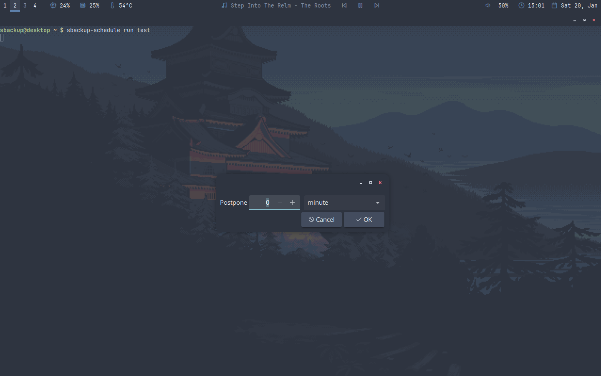

# sbackup

A simple backup script written in python, is just a configuration reader and writer with some scheduling functionality added trough a bash script using the `at` command. The configuration file is written in `.ini` format.

To use the bash script is needed `yad` and a notification server running with support for `libnotifyd` actions such as `dunst`. This script allows the user to schedule backups using `at`, so make sure you have `at` enabled at startup in `systemd`. When the scheduled time arrives the scripts shows a notification to the user, if the user executes the action of the notification the script ask the user to give a time to postpone the backup, otherwise ask for the amount of cores the user want to be used to make the backup.

The installation script is really simple, if you want to add functionality please make a pull request, any improvements are welcome.

## Installation

```bash
git clone https://github.com/giuli635/sbackup.git
cd sbackup
./install.sh
```

If you prefer to install it for every user in the system you should simply call `install.sh` with `sudo`. The script should notice if any dependency is missing, but I recommend checking this by yourself.

## `sbackup` usage:
```
usage: sbackup [-h] [-c CONFIG_FILE]
               {list,ls,add,remove,rm,info,make,mk,rename,rn,modify,md} ...

Simple backup managment with configuration files.

positional arguments:
  {list,ls,add,remove,rm,info,make,mk,rename,rn,modify,md}
    list (ls)           prints out a list of the backup entries in the
                        configuration file
    add                 creates a new configuration entry with a given backup
                        location and FILES, if no backup location is given,
                        uses the current directory
    remove (rm)         remove backups from the configuration file
    info                remove backups from the configuration file
    make (mk)           make the specified backups
    rename (rn)         rename a backup entry
    modify (md)         modify the specified configuration fields

options:
  -h, --help            show this help message and exit
  -c CONFIG_FILE, --configuration-file CONFIG_FILE
                        specifies the configuration file to use, the default
                        location is ~/.config/backup-config.ini
```

```
usage: sbackup list [-h]

options:
  -h, --help  show this help message and exit
```

```
usage: sbackup add [-h] [-f FRECUENCY] [-l PATH] NAME FILES [FILES ...]

positional arguments:
  NAME                  specifies the name of the backup
  FILES                 list of files to use in the backup entry

options:
  -h, --help            show this help message and exit
  -f FRECUENCY, --frequency FRECUENCY
                        specifies the frequency of the backups in the format
                        accepted by at, in format now + frequency (see: man
                        at), defaults to one week
  -l PATH, --location PATH
                        specifies the backup location
```

```
usage: sbackup remove [-h] BACKUPS [BACKUPS ...]

positional arguments:
  BACKUPS     list of backups to delete

options:
  -h, --help  show this help message and exit
```

```
usage: sbackup info [-h] [-a {paths,location,frequency}] BACKUPS [BACKUPS ...]

positional arguments:
  BACKUPS               list of backups of which the information is obtained

options:
  -h, --help            show this help message and exit
  -a {paths,location,frequency}, --about {paths,location,frequency}
                        specifies the configuration fields to show
```

```
usage: sbackup make [-h] [-l PATH] [-c CORES] BACKUPS [BACKUPS ...]

positional arguments:
  BACKUPS               list of backups to make

options:
  -h, --help            show this help message and exit
  -l PATH, --location PATH
                        overwrites the configuration backup location
  -c CORES, --cores CORES
                        number of cores to be used by zstd (passed as -T, see
                        ztsd docs)
```

```
usage: sbackup rename [-h] BACKUP NAME

positional arguments:
  BACKUP      name of the backup to rename
  NAME        new name

options:
  -h, --help  show this help message and exit
```

```
usage: sbackup modify [-h] {location,frequency,add,remove} ...

positional arguments:
  {location,frequency,add,remove}
    location            changes the backups' location
    frequency           changes the backups' frequency
    add                 add paths the backup configuration
    remove              remove paths the backup configuration

options:
  -h, --help            show this help message and exit
```

## Configuration example

```ini
[test]
paths = {'/home/giuliano/.config/', '/etc/'}
location = /my/backup/location
frequency = 1 week

[test1]
paths = {'/home/user/games/', '/home/user/programs/', '/home/user/.bashrc'}
location = /my/backup/location
frequency = 10 days
```

## `sbackup-schedule` usage

```
Usage: sbackup-schedule BACKUPS [BACKUPS...]
   or: sbackup-schedule run BACKUPS [BACKUPS...]

A script schedule the usage of sbackup. Uses sbackup
to obtain the frequency the backup should be made.

Positional arguments
  BACKUPS                 the sbackup backups to schedule
  run                     shows a notification of the noticing the user
                          a backup is scheduled, and using yad and notify-send
                          actions allows to specify a postponment time.
                          Also allows the user to specify the cores used by zstd
                          at the moment of creating the backup.

Options:
  -h                      shows this help and exits
```

## Images

 
 


